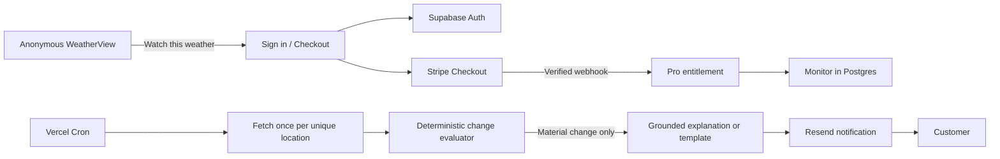

# WeatherView Pro: monitoring and accounts

Status: product and architecture decision, August 22, 2026. This document
defines the first paid workflow. It does not authorize a public paid launch;
the launch gates near the end must be completed first.

## Product rule

WeatherView is complete and useful without an account. An account appears only
when WeatherView must remember something on the server, monitor it while the
visitor is away, synchronize it between devices, or bill for it.

The first Pro promise is:

> Tell WeatherView what matters. It will watch the forecast and contact you only
> when something meaningfully changes.

This is more defensible than charging for forecast length, public-safety alerts,
radar, weather stories, or generic summaries. It monetizes continuing work done
for one person rather than withholding weather information.

## Account boundary

| Experience | Account | Plan |
|---|---:|---|
| Forecasts, radar, government alerts and weather stories | No | Free |
| Briefing, activity scores and computed weather watches | No | Free |
| Save locations, units and theme on the current device | No | Free |
| Receive official public-safety information while using the site | No | Free |
| Synchronize locations and preferences between devices | Yes | Pro initially |
| Monitor a plan, commute or threshold while away | Yes | Pro |
| Receive personalized email or push updates | Yes | Pro |
| Ask questions using persistent personal context | Yes | Pro, later |

There is no general registration campaign in the first release. The primary
account entry point is **Watch this weather**. A quiet **Sign in** link can exist
for returning customers, but free visitors are never interrupted by it.

## First customer journey

1. A visitor views a location and selects **Watch this weather**.
2. WeatherView asks what they care about, using a short preset instead of a
   blank chatbot.
3. The configuration remains in the browser while the visitor signs in with an
   email magic link or one-time code. WeatherView never manages passwords.
4. If the visitor has no active entitlement, WeatherView sends them to Stripe
   Checkout.
5. A verified Stripe webhook activates Pro. The browser redirect alone never
   grants access.
6. WeatherView creates the monitor and shows exactly what will trigger a
   notification, the evaluation frequency and how to pause or delete it.
7. The customer receives a message only after a material new change. Every
   message includes the location, forecast time, reason, source and a one-click
   manage/unsubscribe link.

An abandoned checkout may leave an account but must not leave an active monitor
or billable background work.

## Monitoring scope

### Version 1 presets

Build these on one shared rule engine, in this order:

1. **Plan watch** — one location and future time window for camping, a game,
   gardening, a patio, a walk or another outdoor plan. It expires after the
   event.
2. **Commute watch** — recurring weekday morning and/or evening windows at one
   or two locations. It watches precipitation, freezing conditions, snow, wind
   and visibility-related signals.
3. **Threshold watch** — notify when a selected value crosses a user-controlled
   threshold, such as frost risk, gust speed, snowfall, rainfall, heat or AQI.

Do not begin with an unrestricted natural-language rule builder. Presets make
the promise visible, testable and safe. Natural language can fill the same
structured rule schema later.

### Suggested Pro allowance

- Up to 10 active monitors.
- Up to 5 saved locations.
- Hourly evaluation; an official warning can be ingested sooner if the provider
  supports it.
- Email delivery first. Web Push follows after delivery quality is established.
- No per-message fee shown to customers and no rollover credit system.

These are product limits, not database limits. Keep them configurable so they
can change without a migration.

## What counts as a meaningful change

The trigger must be deterministic. AI does not decide whether to notify.
Initial candidate thresholds are:

| Change | Candidate threshold |
|---|---:|
| Precipitation start or end moves | 90 minutes |
| Precipitation probability changes | 20 percentage points |
| Rain total changes | 5 mm or 50%, whichever is smaller above 2 mm |
| Snow total changes | 2 cm |
| Forecast temperature changes | 3 C |
| Maximum gust changes | 15 km/h |
| Condition crosses freezing | Either direction |
| Forecast begins or stops showing thunder/freezing rain | Any transition |
| Official alert begins, escalates or ends | Any transition |

The evaluator also applies context:

- Ignore changes outside the customer's watched time window.
- Require the new condition to remain present in two adjacent hourly samples
  unless it is an official alert or a high-severity threshold.
- Assign a stable event fingerprint and never deliver it twice.
- Default to no more than two proactive messages per monitor in 24 hours.
- Respect local quiet hours. Do not override them for WeatherView-computed
  watches; official authorities remain the safety source.
- Send an all-clear only when a previously delivered material condition has
  genuinely fallen below its exit threshold.

Thresholds must be evaluated against real forecast revisions during the beta.
They are starting hypotheses, not scientific constants.

## The role of AI

Numbers select the event; AI may explain it afterward.

1. Fetch one forecast per unique location, not per customer.
2. Normalize it and compare it with the previous snapshot.
3. Evaluate every applicable structured monitor deterministically.
4. If nothing material changed, make no AI request and send nothing.
5. For a real event, create one grounded explanation for the shared
   location/event evidence. Personalize the salutation and watched window with
   templates rather than another model request.
6. Store the evidence, prompt version, model, token usage and cost with the
   event.

The model may explain timing, direction and practical relevance. It must not
invent impacts, declare an activity safe, turn a computed threshold into an
official warning, or supersede the linked authority. A deterministic fallback
template must be capable of sending every notification if AI is unavailable.

## Recommended backend

The current Vercel Functions remain the application backend. Add three managed
services only when implementation begins:

| Responsibility | Recommended service | Initial cost posture |
|---|---|---|
| Authentication and relational data | Supabase Auth + Postgres | Free during private beta; Pro before relying on it for paid production |
| Subscription billing | Stripe Checkout, Billing and Customer Portal | Pay per successful transaction and billing volume |
| Magic-link and notification email | Resend | Free while under its daily/monthly limits |
| Scheduling and API execution | Existing Vercel Pro project | Already paid |
| Explanations | Direct OpenAI GPT-5.6 Luna | Only after material events |

Supabase is preferred over separate identity and database vendors because this
feature needs relational storage regardless. WeatherView is not a Next.js app,
so a Next.js-specific auth integration would not simplify the existing vanilla
JavaScript and Vercel Function architecture.

The account implementation should use server-handled PKCE/magic-link sessions
with secure cookies. Do not expose a Supabase secret/service-role key to browser
code. Current Supabase server libraries require a modern Node runtime;
WeatherView is already constrained to supported Node 22–24 releases, so account
work must preserve that range rather than silently changing runtimes.

### Request flow

## Minimal data model

Use UUID primary keys and UTC timestamps. Store and display the IANA timezone
for every location and monitor.

### `profiles`

- `user_id` — primary key referencing `auth.users`.
- `timezone`, `created_at`, `deleted_at`.
- Do not duplicate the email unless a product query truly needs it.

### `subscriptions`

- `user_id`, `stripe_customer_id`, `stripe_subscription_id`.
- `status`, `price_id`, `current_period_end`, `cancel_at_period_end`.
- `last_stripe_event_id` for idempotency.
- The verified webhook is authoritative. Never trust plan information supplied
  by the browser or editable user metadata.

### `locations`

- `id`, `user_id`, `label`, `latitude`, `longitude`, `timezone`.
- Store coordinates, not a home street address. Explain this clearly.
- A normalized coordinate key permits safe fetch sharing without revealing
  which users watch that location.

### `monitors`

- `id`, `user_id`, `location_id`, `kind`, `active`.
- `schedule` and `rules` as validated versioned JSON.
- `quiet_hours`, `last_evaluated_at`, `last_notified_at`, `expires_at`.
- Reject unknown schema versions instead of guessing.

### `forecast_snapshots`

- `location_key`, `provider`, `fetched_at`, `valid_until`.
- A normalized forecast payload and content hash.
- Service-only; customers cannot query shared snapshots directly.
- Retain detailed snapshots for 72 hours, then keep only aggregated event
  evidence needed for audit and support.

### `monitor_events`

- `id`, `monitor_id`, `fingerprint`, `event_type`, `severity`.
- Before/after evidence, explanation, prompt/model/usage when applicable.
- `delivery_status`, `provider_message_id`, `notified_at`.
- Unique `(monitor_id, fingerprint)` prevents duplicate delivery.

Every exposed user-owned table must have Row Level Security. Policies must
combine `TO authenticated` with `auth.uid() = user_id`; `TO authenticated` by
itself is not authorization. Internal snapshot and billing tables should be in
an unexposed schema or accessible only through server functions.

## API surface

All state-changing routes accept only same-origin requests, validate content
types and schemas, apply rate limits, and return no secrets.

| Route | Purpose |
|---|---|
| `POST /api/auth/start` | Validate email and start passwordless sign-in |
| `GET /api/auth/confirm` | Exchange the one-time token and establish a session |
| `POST /api/auth/sign-out` | Revoke/clear the session |
| `GET /api/account` | Return profile, entitlement and current limits |
| `GET/POST /api/monitors` | List or create the signed-in customer's monitors |
| `PATCH/DELETE /api/monitors/:id` | Pause, update or delete an owned monitor |
| `POST /api/billing/checkout` | Create a Stripe subscription Checkout session |
| `POST /api/billing/portal` | Open Stripe's hosted customer portal |
| `POST /api/webhooks/stripe` | Verify the raw-body signature and mirror entitlement |
| `POST /api/webhooks/resend` | Record delivery, bounce and complaint state |
| `GET /api/cron/evaluate-monitors` | Authenticated scheduled evaluation |

Stripe and Resend webhook handlers must be idempotent. Stripe signature
verification requires the exact raw request body, before JSON parsing.

## Scheduled evaluation

Use one Vercel Cron route every hour for the first release. Vercel Pro permits
per-minute schedules, but weather models do not justify that cost or noise yet.

The job:

1. Verifies `Authorization: Bearer $CRON_SECRET`.
2. Acquires a run lease keyed to the UTC hour so overlapping invocations exit.
3. Loads active monitors due for evaluation.
4. Groups them by normalized location.
5. Fetches and stores one forecast per location.
6. Compares with the prior snapshot and evaluates monitors.
7. Creates event rows transactionally.
8. Sends undelivered events with deterministic idempotency keys.
9. Records usage, failures and a compact run summary.

Start with bounded batches and a continuation cursor. If one Function can no
longer process the due locations within its safe duration, add a queue then;
do not add one pre-emptively.

## Weather-data commercial-use gate

This gate must be resolved before WeatherView accepts subscriptions.

Open-Meteo's hosted free endpoint is explicitly limited to non-commercial use,
and its terms list a website or app with subscriptions as commercial. The
current application calls the free forecast, air-quality, geocoding and archive
hosts. Open-Meteo's live pricing table currently lists:

- API Standard: EUR 29/month or EUR 319/year, including forecast, air quality
  and geocoding, but not historical weather.
- API Professional: EUR 99/month or EUR 1,099/year, adding historical weather
  and model-comparison products.

That means the existing Almanac prevents a simple move to Standard. Paying EUR
99 before meaningful revenue conflicts with WeatherView's bootstrap strategy.

Evaluate these options before buying a plan:

1. **Visual Crossing metered evaluation — recommended first.** Its current
   documentation permits commercial use, includes forecast and history, offers
   1,000 records/day free, then lists USD 0.0001 per record. Forecast quality,
   attribution, storage rights, query-cost behaviour and alert coverage must be
   tested against WeatherView's real payloads before adoption.
2. **Apple WeatherKit evaluation.** An Apple Developer Program membership
   includes 500,000 calls/month and WeatherKit exposes forecast plus historical
   averages to websites through REST. Confirm the account, attribution and
   redistribution terms fit WeatherView.
3. **Open-Meteo Standard plus an Almanac replacement.** This minimizes code
   change in forecast views but requires replacing the historical archive with
   public climatology or a separately licensed source.
4. **Open-Meteo Professional.** Operationally simplest, but defer until revenue
   supports its fixed cost.

Whichever provider wins, first move all weather hosts and credentials behind a
provider adapter. Do not scatter another vendor's URLs through handlers.

Sources, checked August 22, 2026:

- [Open-Meteo pricing](https://open-meteo.com/en/pricing)
- [Open-Meteo commercial-use terms](https://open-meteo.com/en/terms)
- [Visual Crossing commercial metered API](https://www.visualcrossing.com/weather-api/)
- [Apple WeatherKit availability and pricing](https://developer.apple.com/weatherkit/)

## Price and margin hypothesis

Test **CA$5.99/month** and **CA$49.99/year** for one Pro plan. Keep Stripe price
IDs in environment variables so price tests do not require code changes.

At current Canadian standard pricing, a domestic monthly card payment costs
2.9% + CA$0.30, and Stripe Billing adds 0.7% of billing volume. Fifty monthly
customers at CA$5.99 produce CA$299.50 gross and approximately CA$273.72 after
those two Stripe fees, before tax, refunds, weather data and other providers.

Initial infrastructure posture:

- Vercel Pro: already paid.
- Supabase: USD 0 private beta; budget USD 25/month before treating it as a
  production dependency with paying customers and backups.
- Resend: USD 0 up to 3,000 emails/month and 100/day; then currently USD
  20/month for 50,000.
- Luna: expected to remain pennies at early scale because it runs only for real
  events, with templates as the fallback.
- Weather data: unresolved gate above; prefer usage-based commercial terms over
  a large fixed plan while adoption is uncertain.

Pricing is a hypothesis, not a promise. Recheck every linked provider before
launch and alert on usage before enabling any automatic overage.

## Privacy, safety and support

- Collect only email, coarse location coordinates, timezone, watch settings and
  billing-provider identifiers required to deliver the service.
- Never request or store a street address for weather monitoring.
- Provide download, pause, unsubscribe and account deletion controls.
- On deletion, revoke active sessions, cancel or detach monitoring, and remove
  personal rows according to a documented retention policy.
- Do not put precise customer coordinates, email or monitor text into model
  prompts when a coarse/shared event explanation is sufficient.
- Public-safety alerts remain free in the product. Pro buys delivery and
  personalization, not exclusive access to authoritative warnings.
- Every computed message says it is forecast guidance, shows its source time,
  and links to the relevant official authority when safety is involved.
- Add a delivery-support view before launch: recent runs, event evidence,
  suppression reason, provider response and retry state.

## Delivery plan

### Phase 0 — provider and rule validation

- Build a recorded-payload comparison of Open-Meteo, Visual Crossing and
  WeatherKit for representative Canadian, US and international locations.
- With `VISUAL_CROSSING_API_KEY` in Vercel Development, run the first live
  comparison without storing payloads:
  `vercel env run -- npm run providers:compare -- --city toronto --hours 72`.
- Keep Open-Meteo on the existing anonymous experience during prototyping. Its
  hosted free endpoint must be replaced or commercially licensed before the
  app carries subscriptions or advertising.
- Confirm commercial licence, attribution, caching and derived-content terms in
  writing when they are ambiguous.
- Run the monitor evaluator offline against successive saved forecasts.
- Tune material-change thresholds and measure notification frequency.

Initial live baseline, measured August 22, 2026 over the next 72 aligned hours:

| Location | Temperature MAD | Precipitation probability MAD | Wind-gust MAD | Visual Crossing query cost |
| --- | ---: | ---: | ---: | ---: |
| Toronto | 1.20°C | 17.97 points | 5.52 km/h | 1 |
| Ottawa | 0.83°C | 17.88 points | 4.95 km/h | 1 |
| Vancouver | 0.96°C | 5.35 points | 4.13 km/h | 1 |
| New York | 1.31°C | 8.50 points | 5.37 km/h | 1 |
| London | 1.19°C | 4.96 points | 8.61 km/h | 1 |
| Sydney | 0.66°C | 15.33 points | 6.26 km/h | 1 |

All six comparisons returned 192 hourly records per provider with matching local
timezones. A five-location parallel burst produced two upstream HTTP 429s; both
locations succeeded immediately when retried sequentially. Keep evaluations
sequential or rate-limited, share forecast results by location/time bucket, and
use the provider-specific error label before attributing future throttling.

The successive-revision trial is implemented in
`.github/workflows/monitoring-trial.yml`. Every six hours it samples the same
six public locations sequentially through WeatherView's cached production
weather endpoint, restores the preceding normalized
snapshots, runs the deterministic evaluator, and saves a cumulative internal
artifact for 30 days. It deliberately stores no visitor data, sends no
notification, duplicates no provider credential and provisions no customer
database. Each sample records whether the primary provider or fallback
answered. Review `summary.json` and
the per-run evidence after at least one week before changing thresholds or
starting account work.

### Phase 1 — account foundation

- Provision Supabase through Vercel, configure a production SMTP provider, and
  use migrations for the schema and RLS policies.
- Implement passwordless sign-in, sign-out, account deletion and session tests.
- Keep all existing pages anonymous and verify no performance regression.

### Phase 2 — billing foundation

- Create one monthly and one annual Stripe price in test mode.
- Implement Checkout, raw-body verified webhooks, entitlement middleware and
  Customer Portal access.
- Test renewal, failed payment, cancellation, webhook reordering and replay.

### Phase 3 — silent monitoring beta

- Add plan watches and the hourly evaluator.
- Record proposed notifications without sending them for at least one week.
- Review every candidate for usefulness, false positives and missed events.
- Add email only after the silent-event quality is acceptable.

### Phase 4 — small paid beta

- Invite a very small group, keep human-visible run logs, and cap watches.
- Measure activation, notification usefulness, unsubscribes, failures, provider
  cost per active account and support time.
- Do not add an AI chat allowance until monitoring itself earns retention.

## Launch gates

Do not accept a live payment until all are true:

- A commercial weather-data path covers every retained public feature.
- Terms permit caching, derived alerts and customer-facing display.
- Stripe webhook replay and out-of-order delivery tests pass.
- RLS tests prove one user cannot read or mutate another user's rows.
- Cron overlap cannot create duplicate events or emails.
- Customers can pause, unsubscribe, cancel billing and delete their account.
- Quiet hours, timezone boundaries and daylight-saving transitions are tested.
- A deterministic notification works when Luna or the email provider fails.
- Usage caps and billing alerts are configured at every paid provider.
- Privacy policy, terms, AI disclosure and weather-safety language are live.

The next engineering task is Phase 0: a provider bake-off and an offline,
deterministic forecast-diff evaluator. It proves both the data cost and the paid
feature before account infrastructure is installed.
